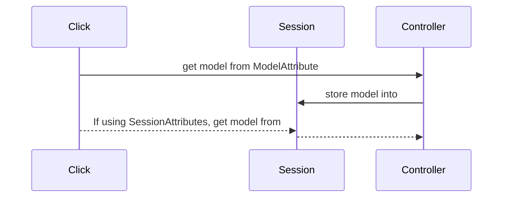

```mermaid
sequenceDiagram
    participant Click
    participant Session
    participant Controller
    Click->>Controller: get model from ModelAttribute
    Controller->>Session: store model into  
    Click-->>Session: If using SessionAttributes, get model from
    Session-->>Controller: 

```